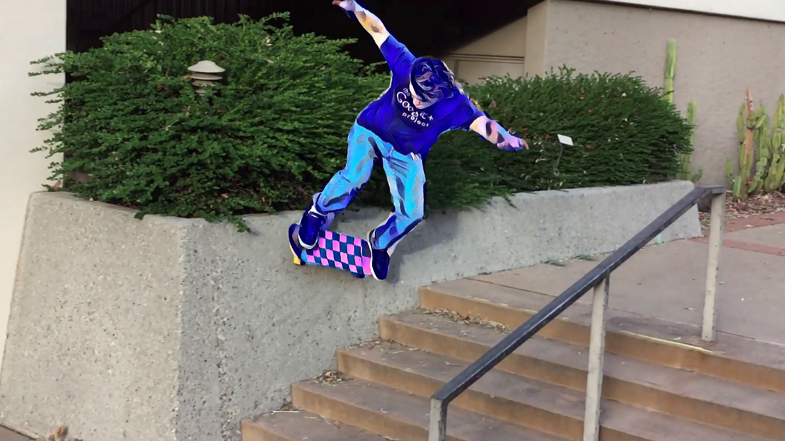

# Clas Style Transfer using Google Colab

# Blogpost

https://thomasdougherty.ai/class-style-transfer/

# About

This is a tutorial on how to run class style transfers on your own image or video. I wrote everything in Google Colab so there is no setup to use, while providing free access to computing resources including GPUs.
